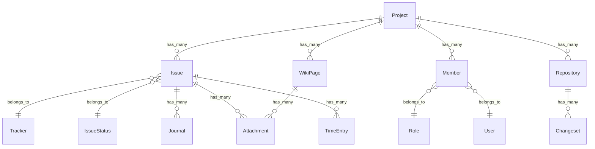

# ドメインモデル（概念）

## 主要エンティティ

- Project: プロジェクト。モジュール有効化、メンバー、リポジトリ等の親。
- User / Group: ユーザー/グループ。認証、権限、通知先。
- Role / Member: 参加（メンバーシップ）とロール（権限集合）。
- Issue: 課題。トラッカー/ステータス/優先度/担当者/期日等を持つ。
- Tracker: 課題種別。フィールド構成やワークフローの軸。
- IssueStatus: ステータス。遷移・編集可否に影響。
- Workflow*: 遷移やフィールド権限（トラッカー×ロール×ステータス）を表現。
- Journal: 更新履歴（コメント/変更点）。
- Attachment: 添付ファイル。課題/Wiki/文書/掲示板等に紐付く。
- TimeEntry: 作業時間。課題/プロジェクトに紐付く。
- WikiPage / WikiContent: Wiki。
- Repository / Changeset: リポジトリと変更セット（関連課題等）。

## 概念 ER（簡略）

## 根拠（自動抽出）

- 詳細な関連（静的抽出）は `auto_extract_sanitized/domain_relations.md` を参照（取りこぼし可能性あり）。

