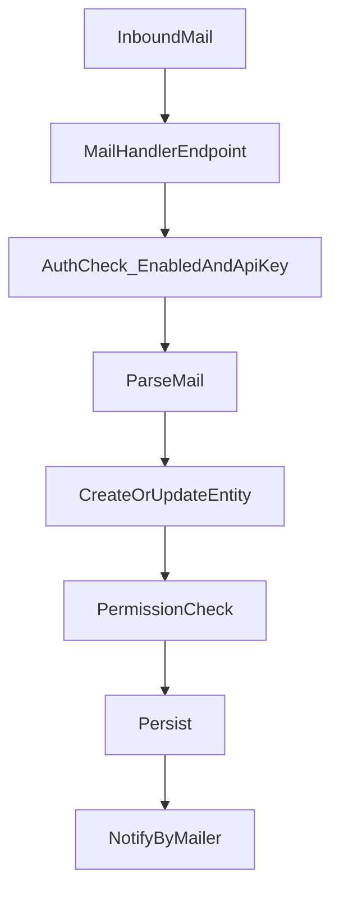

# 通知/メール

## 送信（通知）

- 主要イベント（課題作成/更新、セキュリティ通知、設定更新 等）に対して、Mailer 経由でメールを送信する。
- 通知対象の決定は、ウォッチャー/関係者/購読設定（イベント種別）などの合成。

## 受信（取り込み）

- HTTP エンドポイント（`mail_handler`）を入口に、メール本文/ヘッダから課題作成・返信等を行う。
- 有効化フラグと API キー等の設定により保護される（設定キーの存在が確認できる）。

## フロー（概略）

## 根拠（自動抽出）

- ジョブ/メール入口の一覧: `auto_extract_sanitized/jobs_and_mail.md`
- 設定キー: `auto_extract_sanitized/settings_keys.md`（mail_handler_*）

## AIアシスト（想定）

- 期限接近/停滞見込みの通知をメールで配信する（抑制・集約あり）
- 週次レポートをメールで配信する（プロジェクト/個人）
- 詳細は `14_ai_assist.md` を参照
