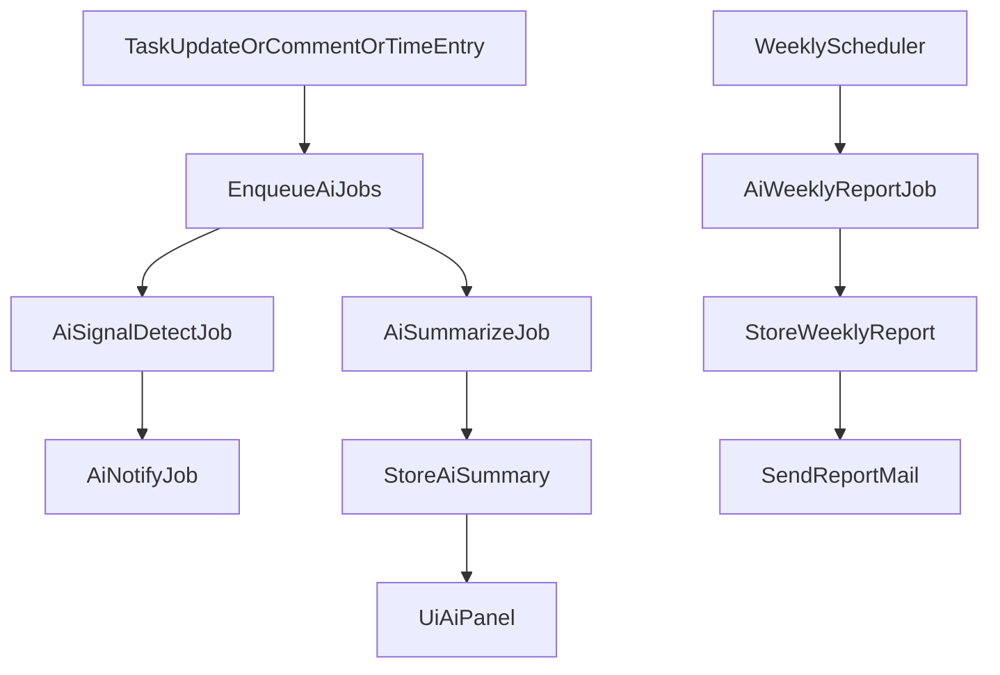

# AIアシスト機能（想定仕様）

## 目的

本機能は、タスク（課題）の運用を「漏れなく・遅れなく・状況が分かる」状態に近づけるために、以下を自動化/支援する。

- 期限接近タスクの通知
- 進捗が滞りそうなタスクの関係者リマインド
- タスク内容の記憶（コンテキスト保持）と進捗の自動要約
- コメント履歴/工数履歴の要約と現状理解の提示
- 週次レポートの自動作成
- タスクごとのボトルネック検知と対応策提案
- 次に対応すべきタスクの提示

## 対象範囲

- 対象: タスク（課題）・コメント（ジャーナル）・工数（作業時間）・担当/ウォッチャー等の関係者・期限/更新日時
- 除外（初期想定）: 添付ファイル本文、外部リポジトリのソースコード本文（メタ情報のみは可）

## 画面/UX（想定）

- タスク詳細に「AIアシスト」パネル
  - 現状サマリ（1〜5行）
  - 最近の動き（コメント/更新/工数の要約）
  - リスク（遅延/ボトルネック）と根拠
  - 次アクション候補（優先度順）
- 一覧に「注意」バッジ（期限接近/停滞/ブロッカー）
- 週次レポート画面（プロジェクト単位/ユーザー単位）
- 管理: 全体/プロジェクト単位の有効化、閾値、通知先、利用制限

## 機能要件

### 1) 期限が近づいているタスクの通知

- **トリガ**: `期日` が現在日時 + N日以内（Nは設定）
- **対象**: 担当者、作成者、ウォッチャー、（任意で）プロジェクト管理者
- **抑制**: 直近M時間以内に通知済みの同一タスクは再通知しない
- **通知チャネル**: メール（将来: Web通知/外部連携）

### 2) 進捗が滞りそうなタスクのリマインド

「滞りそう」の判定は、複数シグナルのスコアリングで行う（閾値は設定）。

- **シグナル例**
  - 最終更新からX日以上経過
  - ステータスが「進行中」だが工数入力がY日ない
  - 期日に対して残日数が少ないのに進捗指標（例: 進捗率）が低い
  - ブロッカー関係（関連/依存）で上流が未完了
- **通知先**
  - 担当者 + 関係者（ウォッチャー/管理者など設定可能）
- **内容**
  - 遅延見込み、根拠（シグナルの内訳）、推奨アクション

### 3) タスク内容を覚え、進捗を自動要約

- **入力（根拠）**: タスク本文、属性（期日/担当/優先度/ステータス）、最新K件のコメント、最新K件の変更履歴、最新K件の工数入力
- **出力**
  - 現状要約（短/中の2種類）
  - 直近の変化点（箇条書き）
  - 未解決論点/次アクション（箇条書き）
- **更新タイミング**
  - タスク更新時に軽量要約（同期は避け、非同期生成）
  - 定期バッチで再計算（過去分の整合）

### 4) コメント履歴や工数履歴の要約と現状理解の提示

- コメント: 意思決定/懸念/合意/ToDo を抽出して整理
- 工数: 期間別の推移、偏り（誰がどのくらい）、未入力期間の検知
- 表示: 「今どういう状態か」を1分で理解できる要約 + 根拠（引用は最小限）

### 5) 週次レポートの自動作成

- **単位**: プロジェクト週次 / 個人週次（両方）
- **内容（例）**
  - 完了タスク、進行中、ブロック、期限接近
  - 重要な変更/意思決定（コメント要約）
  - 工数サマリ（合計、上位タスク）
  - リスク/ボトルネックと推奨対応
- **配信**: メール + 画面で閲覧

### 6) ボトルネック検知と対応策提案

- **検知対象（例）**
  - ブロッカー関係の詰まり（依存先未完了）
  - リソース過負荷（担当のWIP過多、稼働超過）
  - 仕様不明（コメントで質問が未解決のまま経過）
  - 工数未入力/更新なしの停滞
- **提案の型**
  - 状況→原因候補→推奨対応（テンプレート化）
  - 例: 担当追加/優先度調整/期日再設定/ブロッカー解消依頼

### 7) 次に対応すべきタスクの提示

- **入力**: 優先度、期日、停滞スコア、依存関係、担当の空き、未完了ToDoの有無
- **出力**: 「次にやるべき上位N件」+ 理由
- **フィルタ**: 自分の担当/ウォッチ/自分が関与するタスクに限定可

## データ/ストレージ（想定）

### 保存するもの

- `ai_summary`（短/中）、`ai_last_generated_at`
- `ai_signals`（期限接近/停滞/ブロッカー等の内訳とスコア）
- `weekly_report`（本文、対象期間、生成根拠メタ）

### 保存しない（初期想定）

- 外部AIへ送信した生テキストの全量ログ（監査要件があれば別途）

## 権限/可視性（想定）

- 生成結果は「元のタスク/コメント/工数を閲覧できるユーザー」に限定して表示
- 週次レポートはプロジェクト権限/役割に応じて閲覧範囲を制限
- 管理者のみ変更可能な設定（全体有効化、外部送信可否、保持期間 等）を持つ

## 非機能要件（想定）

- **遅延耐性**: 生成は非同期。UIは「最新生成時刻」を表示し、未生成でも運用可能
- **コスト制御**: 1日あたり生成回数/トークン上限、対象プロジェクト制限、夜間バッチ集約
- **品質**: 根拠シグナルの提示、確信度の表示、誤り訂正（ユーザーがフィードバック）
- **監査**: いつ/誰が/何に対して生成したかを最小限記録（個人情報に配慮）

## セキュリティ/プライバシー（想定）

- 外部送信する場合は、機密情報・個人情報のマスキング（メール/電話/鍵/URL等のパターン）
- プロジェクト単位で外部送信を禁止できる
- 生成結果はキャッシュされるが、アクセス制御は元データと同等

## 処理フロー（概略）

