# Model relations (static extract)

- Source: `app/models/**/*.rb`
- Note: associations are extracted by regex and may miss dynamic definitions.

## Mermaid (conceptual ER / reference)

```mermaid
erDiagram
  Attachment }o--|| Container : belongs_to
  Attachment }o--|| Author : belongs_to
  AuthSourceException ||--o{ User : has_many
  Board }o--|| Project : belongs_to
  Board ||--o{ Message : has_many
  Board }o--|| LastMessage : belongs_to
  Change }o--|| Changeset : belongs_to
  Changeset }o--|| Repository : belongs_to
  Changeset }o--|| User : belongs_to
  Changeset ||--o{ Filechange : has_many
  Changeset }o--o{ Issue : has_and_belongs_to_many
  Changeset }o--o{ Parent : has_and_belongs_to_many
  Changeset }o--o{ Children : has_and_belongs_to_many
  Comment }o--|| Commented : belongs_to
  Comment }o--|| Author : belongs_to
  CustomField ||--o{ Enumeration : has_many
  CustomField ||--o{ CustomValue : has_many
  CustomField }o--o{ Role : has_and_belongs_to_many
  CustomFieldEnumeration }o--|| CustomField : belongs_to
  CustomValue }o--|| CustomField : belongs_to
  CustomValue }o--|| Customized : belongs_to
  Document }o--|| Project : belongs_to
  Document }o--|| Category : belongs_to
  DocumentCategory ||--o{ Document : has_many
  EmailAddress }o--|| User : belongs_to
  EnabledModule }o--|| Project : belongs_to
  Enumeration }o--|| Project : belongs_to
  Group }o--o{ User : has_and_belongs_to_many
  Import ||--o{ Item : has_many
  Import }o--|| User : belongs_to
  ImportItem }o--|| Import : belongs_to
  Issue }o--|| Project : belongs_to
  Issue }o--|| Tracker : belongs_to
  Issue }o--|| Status : belongs_to
  Issue }o--|| Author : belongs_to
  Issue }o--|| AssignedTo : belongs_to
  Issue }o--|| FixedVersion : belongs_to
  Issue }o--|| Priority : belongs_to
  Issue }o--|| Category : belongs_to
  Issue ||--o{ Journal : has_many
  Issue ||--o{ TimeEntry : has_many
  Issue }o--o{ Changeset : has_and_belongs_to_many
  Issue ||--o{ RelationsFrom : has_many
  Issue ||--o{ RelationsTo : has_many
  IssueCategory }o--|| Project : belongs_to
  IssueCategory }o--|| AssignedTo : belongs_to
  IssueCategory ||--o{ Issue : has_many
  IssueCustomField }o--o{ Project : has_and_belongs_to_many
  IssueCustomField }o--o{ Tracker : has_and_belongs_to_many
  IssuePriority ||--o{ Issue : has_many
  IssueQuery ||--o{ Project : has_many
  IssueRelation }o--|| IssueFrom : belongs_to
  IssueRelation }o--|| IssueTo : belongs_to
  IssueStatus ||--o{ Workflow : has_many
  IssueStatus ||--o{ WorkflowTransitionsAsNewStatu : has_many
  Journal }o--|| Journalized : belongs_to
  Journal }o--|| Issue : belongs_to
  Journal }o--|| User : belongs_to
  Journal }o--|| UpdatedBy : belongs_to
  Journal ||--o{ Detail : has_many
  JournalDetail }o--|| Journal : belongs_to
  Member }o--|| User : belongs_to
  Member }o--|| Principal : belongs_to
  Member ||--o{ MemberRole : has_many
  Member ||--o{ Role : has_many
  Member }o--|| Project : belongs_to
  MemberRole }o--|| Member : belongs_to
  MemberRole }o--|| Role : belongs_to
  Message }o--|| Board : belongs_to
  Message }o--|| Author : belongs_to
  Message }o--|| LastReply : belongs_to
  News }o--|| Project : belongs_to
  News }o--|| Author : belongs_to
  News ||--o{ Comment : has_many
  Principal ||--o{ Member : has_many
  Principal ||--o{ Membership : has_many
  Principal ||--o{ Project : has_many
  Principal ||--o{ IssueCategory : has_many
  Project ||--o{ Membership : has_many
  Project ||--o{ Member : has_many
  Project ||--o{ EnabledModule : has_many
  Project }o--o{ Tracker : has_and_belongs_to_many
  Project ||--o{ Issue : has_many
  Project ||--o{ IssueChange : has_many
  Project ||--o{ Version : has_many
  Project }o--|| DefaultVersion : belongs_to
  Project }o--|| DefaultAssignedTo : belongs_to
  Project ||--o{ TimeEntry : has_many
  Project ||--o{ TimeEntryActivity : has_many
  Project ||--o{ Query : has_many
  Project ||--o{ Document : has_many
  Project ||--o{ New : has_many
  Project ||--o{ IssueCategory : has_many
  Project ||--o{ Board : has_many
  Project ||--|| Repository : has_one
  Project ||--o{ Repository : has_many
  Project ||--o{ Changeset : has_many
  Project ||--|| Wiki : has_one
  Project }o--o{ IssueCustomField : has_and_belongs_to_many
  Project }o--|| DefaultIssueQuery : belongs_to
  QueryColumn }o--|| Project : belongs_to
  QueryColumn }o--|| User : belongs_to
  QueryColumn }o--o{ Role : has_and_belongs_to_many
  ScmFetchError }o--|| Project : belongs_to
  ScmFetchError ||--o{ Changeset : has_many
  ScmFetchError ||--o{ Filechange : has_many
  Repository_Mercurial ||--o{ Changeset : has_many
  Role }o--|| DefaultTimeEntryActivity : belongs_to
  Role ||--o{ WorkflowRule : has_many
  Role }o--o{ CustomField : has_and_belongs_to_many
  Role }o--o{ ManagedRole : has_and_belongs_to_many
  Role }o--o{ Query : has_and_belongs_to_many
  Role ||--o{ MemberRole : has_many
  Role ||--o{ Member : has_many
  TimeEntry }o--|| Project : belongs_to
  TimeEntry }o--|| Issue : belongs_to
  TimeEntry }o--|| User : belongs_to
  TimeEntry }o--|| Author : belongs_to
  TimeEntry }o--|| Activity : belongs_to
  TimeEntryActivity ||--o{ TimeEntry : has_many
  Token }o--|| User : belongs_to
  Tracker }o--|| DefaultStatus : belongs_to
  Tracker ||--o{ Issue : has_many
  Tracker ||--o{ WorkflowRule : has_many
  Tracker }o--o{ Project : has_and_belongs_to_many
  Tracker }o--o{ CustomField : has_and_belongs_to_many
  User }o--o{ Group : has_and_belongs_to_many
  User ||--o{ Changeset : has_many
  User ||--|| Preference : has_one
  User ||--|| AtomToken : has_one
  User ||--|| ApiToken : has_one
  User ||--|| EmailAddress : has_one
  User ||--o{ EmailAddress : has_many
  User }o--|| AuthSource : belongs_to
  UserPreference }o--|| User : belongs_to
  Version }o--|| Project : belongs_to
  Version ||--o{ FixedIssue : has_many
  Watcher }o--|| Watchable : belongs_to
  Watcher }o--|| User : belongs_to
  Wiki }o--|| Project : belongs_to
  Wiki ||--o{ Page : has_many
  Wiki ||--o{ Redirect : has_many
  WikiContent }o--|| Page : belongs_to
  WikiContent }o--|| Author : belongs_to
  WikiContent ||--o{ Version : has_many
  WikiContentVersion }o--|| Page : belongs_to
  WikiContentVersion }o--|| Author : belongs_to
  WikiPage }o--|| Wiki : belongs_to
  WikiPage ||--|| Content : has_one
  WikiPage ||--|| ContentWithoutText : has_one
  WikiRedirect }o--|| Wiki : belongs_to
  WorkflowRule }o--|| Role : belongs_to
  WorkflowRule }o--|| Tracker : belongs_to
  WorkflowRule }o--|| OldStatus : belongs_to
  WorkflowRule }o--|| NewStatus : belongs_to
```

## Extracted list

| from | macro | name | location |
|---|---|---|---|
| `Attachment` | `belongs_to` | `:container` | `app\models\attachment.rb:26` |
| `Attachment` | `belongs_to` | `:author` | `app\models\attachment.rb:27` |
| `AuthSourceException` | `has_many` | `:users` | `app\models\auth_source.rb:30` |
| `Board` | `belongs_to` | `:project` | `app\models\board.rb:22` |
| `Board` | `has_many` | `:messages` | `app\models\board.rb:23` |
| `Board` | `belongs_to` | `:last_message` | `app\models\board.rb:24` |
| `Change` | `belongs_to` | `:changeset` | `app\models\change.rb:21` |
| `Changeset` | `belongs_to` | `:repository` | `app\models\changeset.rb:21` |
| `Changeset` | `belongs_to` | `:user` | `app\models\changeset.rb:22` |
| `Changeset` | `has_many` | `:filechanges` | `app\models\changeset.rb:23` |
| `Changeset` | `has_and_belongs_to_many` | `:issues` | `app\models\changeset.rb:24` |
| `Changeset` | `has_and_belongs_to_many` | `:parents` | `app\models\changeset.rb:25` |
| `Changeset` | `has_and_belongs_to_many` | `:children` | `app\models\changeset.rb:29` |
| `Comment` | `belongs_to` | `:commented` | `app\models\comment.rb:22` |
| `Comment` | `belongs_to` | `:author` | `app\models\comment.rb:23` |
| `CustomField` | `has_many` | `:enumerations` | `app\models\custom_field.rb:24` |
| `CustomField` | `has_many` | `:custom_values` | `app\models\custom_field.rb:28` |
| `CustomField` | `has_and_belongs_to_many` | `:roles` | `app\models\custom_field.rb:29` |
| `CustomFieldEnumeration` | `belongs_to` | `:custom_field` | `app\models\custom_field_enumeration.rb:21` |
| `CustomValue` | `belongs_to` | `:custom_field` | `app\models\custom_value.rb:21` |
| `CustomValue` | `belongs_to` | `:customized` | `app\models\custom_value.rb:22` |
| `Document` | `belongs_to` | `:project` | `app\models\document.rb:22` |
| `Document` | `belongs_to` | `:category` | `app\models\document.rb:23` |
| `DocumentCategory` | `has_many` | `:documents` | `app\models\document_category.rb:21` |
| `EmailAddress` | `belongs_to` | `:user` | `app\models\email_address.rb:23` |
| `EnabledModule` | `belongs_to` | `:project` | `app\models\enabled_module.rb:21` |
| `Enumeration` | `belongs_to` | `:project` | `app\models\enumeration.rb:25` |
| `Group` | `has_and_belongs_to_many` | `:users` | `app\models\group.rb:23` |
| `Import` | `has_many` | `:items` | `app\models\import.rb:23` |
| `Import` | `belongs_to` | `:user` | `app\models\import.rb:24` |
| `ImportItem` | `belongs_to` | `:import` | `app\models\import_item.rb:21` |
| `Issue` | `belongs_to` | `:project` | `app\models\issue.rb:27` |
| `Issue` | `belongs_to` | `:tracker` | `app\models\issue.rb:28` |
| `Issue` | `belongs_to` | `:status` | `app\models\issue.rb:29` |
| `Issue` | `belongs_to` | `:author` | `app\models\issue.rb:30` |
| `Issue` | `belongs_to` | `:assigned_to` | `app\models\issue.rb:31` |
| `Issue` | `belongs_to` | `:fixed_version` | `app\models\issue.rb:32` |
| `Issue` | `belongs_to` | `:priority` | `app\models\issue.rb:33` |
| `Issue` | `belongs_to` | `:category` | `app\models\issue.rb:34` |
| `Issue` | `has_many` | `:journals` | `app\models\issue.rb:36` |
| `Issue` | `has_many` | `:time_entries` | `app\models\issue.rb:37` |
| `Issue` | `has_and_belongs_to_many` | `:changesets` | `app\models\issue.rb:38` |
| `Issue` | `has_many` | `:relations_from` | `app\models\issue.rb:40` |
| `Issue` | `has_many` | `:relations_to` | `app\models\issue.rb:41` |
| `IssueCategory` | `belongs_to` | `:project` | `app\models\issue_category.rb:22` |
| `IssueCategory` | `belongs_to` | `:assigned_to` | `app\models\issue_category.rb:23` |
| `IssueCategory` | `has_many` | `:issues` | `app\models\issue_category.rb:24` |
| `IssueCustomField` | `has_and_belongs_to_many` | `:projects` | `app\models\issue_custom_field.rb:21` |
| `IssueCustomField` | `has_and_belongs_to_many` | `:trackers` | `app\models\issue_custom_field.rb:22` |
| `IssuePriority` | `has_many` | `:issues` | `app\models\issue_priority.rb:21` |
| `IssueQuery` | `has_many` | `:projects` | `app\models\issue_query.rb:76` |
| `IssueRelation` | `belongs_to` | `:issue_from` | `app\models\issue_relation.rb:38` |
| `IssueRelation` | `belongs_to` | `:issue_to` | `app\models\issue_relation.rb:39` |
| `IssueStatus` | `has_many` | `:workflows` | `app\models\issue_status.rb:24` |
| `IssueStatus` | `has_many` | `:workflow_transitions_as_new_status` | `app\models\issue_status.rb:25` |
| `Journal` | `belongs_to` | `:journalized` | `app\models\journal.rb:23` |
| `Journal` | `belongs_to` | `:issue` | `app\models\journal.rb:26` |
| `Journal` | `belongs_to` | `:user` | `app\models\journal.rb:28` |
| `Journal` | `belongs_to` | `:updated_by` | `app\models\journal.rb:29` |
| `Journal` | `has_many` | `:details` | `app\models\journal.rb:30` |
| `JournalDetail` | `belongs_to` | `:journal` | `app\models\journal_detail.rb:21` |
| `Member` | `belongs_to` | `:user` | `app\models\member.rb:21` |
| `Member` | `belongs_to` | `:principal` | `app\models\member.rb:22` |
| `Member` | `has_many` | `:member_roles` | `app\models\member.rb:23` |
| `Member` | `has_many` | `:roles` | `app\models\member.rb:24` |
| `Member` | `belongs_to` | `:project` | `app\models\member.rb:25` |
| `MemberRole` | `belongs_to` | `:member` | `app\models\member_role.rb:21` |
| `MemberRole` | `belongs_to` | `:role` | `app\models\member_role.rb:22` |
| `Message` | `belongs_to` | `:board` | `app\models\message.rb:22` |
| `Message` | `belongs_to` | `:author` | `app\models\message.rb:23` |
| `Message` | `belongs_to` | `:last_reply` | `app\models\message.rb:26` |
| `News` | `belongs_to` | `:project` | `app\models\news.rb:22` |
| `News` | `belongs_to` | `:author` | `app\models\news.rb:23` |
| `News` | `has_many` | `:comments` | `app\models\news.rb:24` |
| `Principal` | `has_many` | `:members` | `app\models\principal.rb:31` |
| `Principal` | `has_many` | `:memberships` | `app\models\principal.rb:32` |
| `Principal` | `has_many` | `:projects` | `app\models\principal.rb:36` |
| `Principal` | `has_many` | `:issue_categories` | `app\models\principal.rb:37` |
| `Project` | `has_many` | `:memberships` | `app\models\project.rb:33` |
| `Project` | `has_many` | `:members` | `app\models\project.rb:35` |
| `Project` | `has_many` | `:enabled_modules` | `app\models\project.rb:37` |
| `Project` | `has_and_belongs_to_many` | `:trackers` | `app\models\project.rb:38` |
| `Project` | `has_many` | `:issues` | `app\models\project.rb:39` |
| `Project` | `has_many` | `:issue_changes` | `app\models\project.rb:40` |
| `Project` | `has_many` | `:versions` | `app\models\project.rb:41` |
| `Project` | `belongs_to` | `:default_version` | `app\models\project.rb:42` |
| `Project` | `belongs_to` | `:default_assigned_to` | `app\models\project.rb:43` |
| `Project` | `has_many` | `:time_entries` | `app\models\project.rb:44` |
| `Project` | `has_many` | `:time_entry_activities` | `app\models\project.rb:46` |
| `Project` | `has_many` | `:queries` | `app\models\project.rb:47` |
| `Project` | `has_many` | `:documents` | `app\models\project.rb:48` |
| `Project` | `has_many` | `:news` | `app\models\project.rb:49` |
| `Project` | `has_many` | `:issue_categories` | `app\models\project.rb:50` |
| `Project` | `has_many` | `:boards` | `app\models\project.rb:51` |
| `Project` | `has_one` | `:repository` | `app\models\project.rb:52` |
| `Project` | `has_many` | `:repositories` | `app\models\project.rb:53` |
| `Project` | `has_many` | `:changesets` | `app\models\project.rb:54` |
| `Project` | `has_one` | `:wiki` | `app\models\project.rb:55` |
| `Project` | `has_and_belongs_to_many` | `:issue_custom_fields` | `app\models\project.rb:57` |
| `Project` | `belongs_to` | `:default_issue_query` | `app\models\project.rb:63` |
| `QueryColumn` | `belongs_to` | `:project` | `app\models\query.rb:255` |
| `QueryColumn` | `belongs_to` | `:user` | `app\models\query.rb:256` |
| `QueryColumn` | `has_and_belongs_to_many` | `:roles` | `app\models\query.rb:257` |
| `ScmFetchError` | `belongs_to` | `:project` | `app\models\repository.rb:29` |
| `ScmFetchError` | `has_many` | `:changesets` | `app\models\repository.rb:30` |
| `ScmFetchError` | `has_many` | `:filechanges` | `app\models\repository.rb:31` |
| `Repository::Mercurial` | `has_many` | `:changesets` | `app\models\repository\mercurial.rb:24` |
| `Role` | `belongs_to` | `:default_time_entry_activity` | `app\models\role.rb:63` |
| `Role` | `has_many` | `:workflow_rules` | `app\models\role.rb:66` |
| `Role` | `has_and_belongs_to_many` | `:custom_fields` | `app\models\role.rb:67` |
| `Role` | `has_and_belongs_to_many` | `:managed_roles` | `app\models\role.rb:69` |
| `Role` | `has_and_belongs_to_many` | `:queries` | `app\models\role.rb:73` |
| `Role` | `has_many` | `:member_roles` | `app\models\role.rb:75` |
| `Role` | `has_many` | `:members` | `app\models\role.rb:76` |
| `TimeEntry` | `belongs_to` | `:project` | `app\models\time_entry.rb:24` |
| `TimeEntry` | `belongs_to` | `:issue` | `app\models\time_entry.rb:25` |
| `TimeEntry` | `belongs_to` | `:user` | `app\models\time_entry.rb:26` |
| `TimeEntry` | `belongs_to` | `:author` | `app\models\time_entry.rb:27` |
| `TimeEntry` | `belongs_to` | `:activity` | `app\models\time_entry.rb:28` |
| `TimeEntryActivity` | `has_many` | `:time_entries` | `app\models\time_entry_activity.rb:21` |
| `Token` | `belongs_to` | `:user` | `app\models\token.rb:21` |
| `Tracker` | `belongs_to` | `:default_status` | `app\models\tracker.rb:32` |
| `Tracker` | `has_many` | `:issues` | `app\models\tracker.rb:33` |
| `Tracker` | `has_many` | `:workflow_rules` | `app\models\tracker.rb:34` |
| `Tracker` | `has_and_belongs_to_many` | `:projects` | `app\models\tracker.rb:35` |
| `Tracker` | `has_and_belongs_to_many` | `:custom_fields` | `app\models\tracker.rb:36` |
| `User` | `has_and_belongs_to_many` | `:groups` | `app\models\user.rb:84` |
| `User` | `has_many` | `:changesets` | `app\models\user.rb:88` |
| `User` | `has_one` | `:preference` | `app\models\user.rb:89` |
| `User` | `has_one` | `:atom_token` | `app\models\user.rb:90` |
| `User` | `has_one` | `:api_token` | `app\models\user.rb:91` |
| `User` | `has_one` | `:email_address` | `app\models\user.rb:92` |
| `User` | `has_many` | `:email_addresses` | `app\models\user.rb:93` |
| `User` | `belongs_to` | `:auth_source` | `app\models\user.rb:94` |
| `UserPreference` | `belongs_to` | `:user` | `app\models\user_preference.rb:25` |
| `Version` | `belongs_to` | `:project` | `app\models\version.rb:118` |
| `Version` | `has_many` | `:fixed_issues` | `app\models\version.rb:119` |
| `Watcher` | `belongs_to` | `:watchable` | `app\models\watcher.rb:21` |
| `Watcher` | `belongs_to` | `:user` | `app\models\watcher.rb:22` |
| `Wiki` | `belongs_to` | `:project` | `app\models\wiki.rb:22` |
| `Wiki` | `has_many` | `:pages` | `app\models\wiki.rb:23` |
| `Wiki` | `has_many` | `:redirects` | `app\models\wiki.rb:24` |
| `WikiContent` | `belongs_to` | `:page` | `app\models\wiki_content.rb:24` |
| `WikiContent` | `belongs_to` | `:author` | `app\models\wiki_content.rb:25` |
| `WikiContent` | `has_many` | `:versions` | `app\models\wiki_content.rb:26` |
| `WikiContentVersion` | `belongs_to` | `:page` | `app\models\wiki_content_version.rb:23` |
| `WikiContentVersion` | `belongs_to` | `:author` | `app\models\wiki_content_version.rb:24` |
| `WikiPage` | `belongs_to` | `:wiki` | `app\models\wiki_page.rb:25` |
| `WikiPage` | `has_one` | `:content` | `app\models\wiki_page.rb:26` |
| `WikiPage` | `has_one` | `:content_without_text` | `app\models\wiki_page.rb:28` |
| `WikiRedirect` | `belongs_to` | `:wiki` | `app\models\wiki_redirect.rb:21` |
| `WorkflowRule` | `belongs_to` | `:role` | `app\models\workflow_rule.rb:23` |
| `WorkflowRule` | `belongs_to` | `:tracker` | `app\models\workflow_rule.rb:24` |
| `WorkflowRule` | `belongs_to` | `:old_status` | `app\models\workflow_rule.rb:25` |
| `WorkflowRule` | `belongs_to` | `:new_status` | `app\models\workflow_rule.rb:26` |
